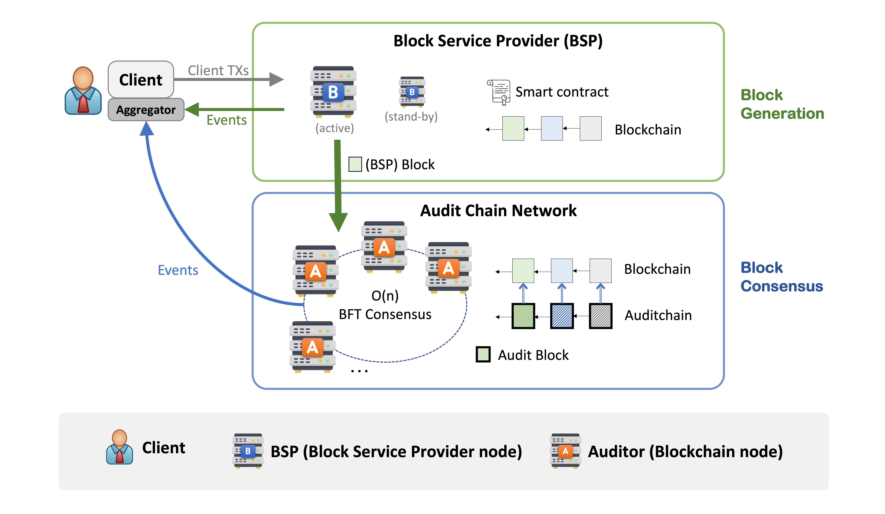
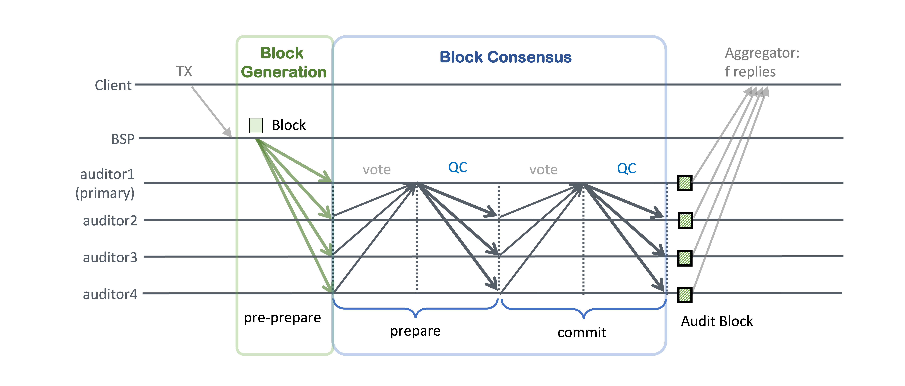
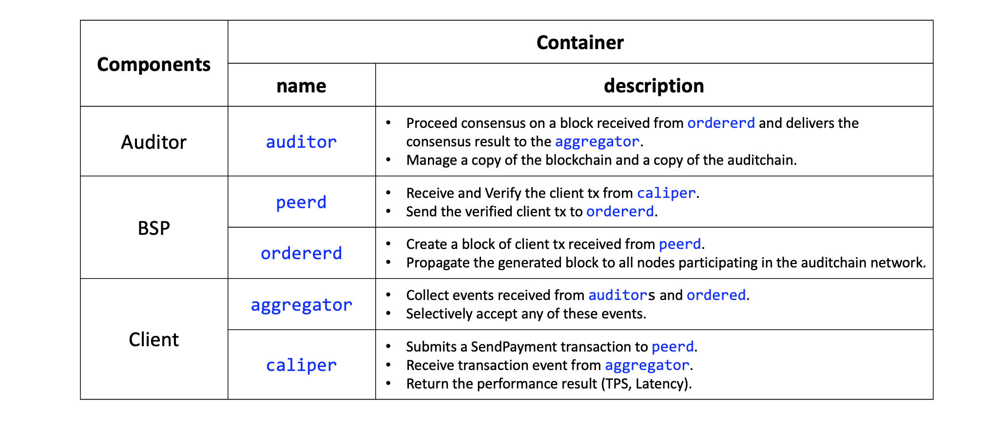

# AuditChain

## Intro
This is a repository for explanations about AuditChain. The code for auditchain is the property of my lab (SSLAB in POSTECH) and is not publicly available.

## About AuditChain: a Private Blockchain Platform 
AuditChain is a private blockchain system using PBFT-like consensus with linear communication complexity, assuming a partially synchronous network. While the traditional PBFT consensus algorithm is monolithic, block generation steps are separated from the consensus layer in AuditChain.

  
  <figcaption>Fig 1. AuditChain architecture consists of three components: a client, a BSP, and auditors.</figcaption>

As shown in Fig 1, AuditChain has two types of nodes: A Block Service Provider (BSP) and consensus nodes called auditors. BSP is responsible for creating blocks, while auditors forming a consensus network are responsible for agreement on blocks received from the BSP. 

  
  <figcaption>Fig 2. Message pattern of AuditChain</figcaption>

The consensus algorithm shown in Fig 2 is like PBFT but with linear O(n) communication complexity. The difference with PBFT is that it is linearized and has an additional node, BSP, as a static block producer.

## Components of Implementation
Each component was developed by containerization according to its function and is composed as follows.

  

